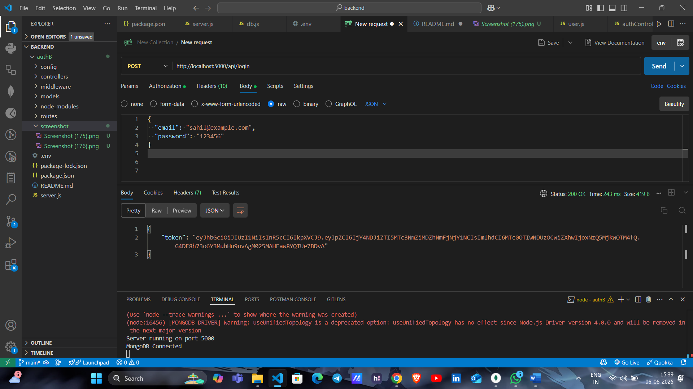

## 🚀 Tech Stack

- **Node.js**
- **Express.js**
- **MongoDB** with **Mongoose**
- **JWT** (JSON Web Tokens) for authentication
- **bcrypt** for password hashing
- **dotenv** for environment variables

## ⚙️ Setup Instructions
### Register a new user
  .png)
1. **Clone the repository:**
```bash
git clone https://github.com/SahiRB1104/Auth.git
cd Auth


-**Install** dependencies:
npm install express mongoose dotenv bcrypt jsonwebtoken joi

Start the server:
npm run dev

The API will run on http://localhost:5000
---------------------------------------------------------------
| Method | Endpoint                 | Description             |
| ------ | ------------------------ | ----------------------- |
| POST   | `/api/register`          | Register a new user     | 
| POST   | `/api/login`             | Login and get JWT       | 
| GET    | `/api/profile`           | Get user profile        | 
| PATCH  | `/api/profile`           | Update name or email    | 
| POST   | `/api/preferences`       | Save user preferences   | 
| GET    | `/api/preferences`       | Fetch saved preferences | 
| GET    | `/api/dashboard-summary` | Dummy dashboard data    | 
---------------------------------------------------------------


Register a new user:  
.png)

Login and get JWT:  
  
.png)

Get and update profile:  
.png)

Save and fetch preferences:  
.png)  
.png)

Dummy dashboard summary:  
.png)

 